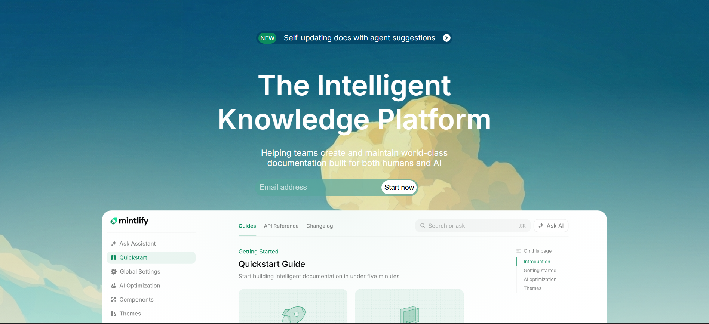
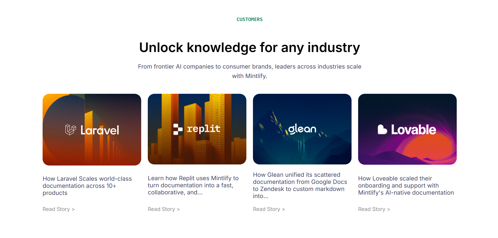
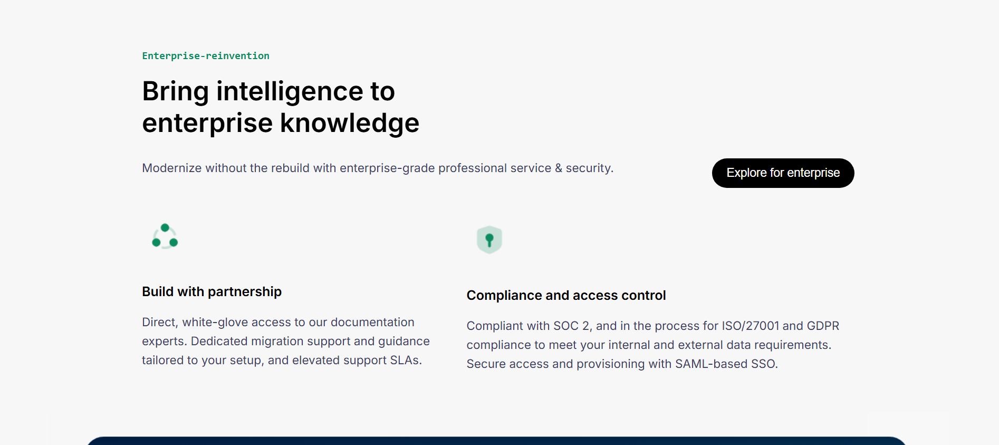
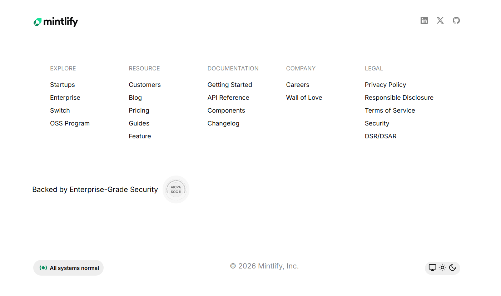

# Mintlify Landing Page Clone

Desktop-first clone of the Mintlify documentation platform landing page built using only HTML and CSS.

## Live Demo

https://imayushsawant.github.io/Mintlify-clone/

## Tech Stack
- HTML5
- CSS3 (Flexbox + Grid)

## Sections Implemented

- Top Navigation Bar
- Hero Section
- Brand Logos Grid
- Feature Sections (2 cards + 1 large card)
- Enterprise Section
- Interactive Image Section
- Customer Stories Carousel
- Final Call-to-Action
- Footer Directory
- Status & Theme Toggle UI

## Fonts & Colors

### Fonts
- Inter (400, 500, 600)

### Colors
- Primary Green: #0C8C5E  
- Background Gray: #F7F7F7  
- Primary Text: #08090A  
- Secondary Text: #3E3E5E  
- Border Gray: #EEEEEE  
- Dark Button: #000000  

## Screenshots

### Navigation Bar & Hero Section

### Carousel Cards Section

### Enterprise Section

### Footer

## Notes

- No JavaScript
- No frameworks (pure HTML + CSS)
- Desktop-first layout
- Flexbox used for alignment
- CSS Grid used for logo and footer sections
- No animations
- Built using semantic HTML and custom CSS
- Images and layout inspired by Mintlify official website
- Project focused on layout practice and CSS architecture learning
